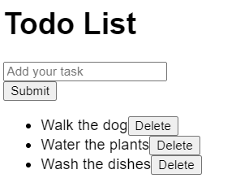

1. Add new tasks on clicking the "Submit" button. The `<input>` field should be cleared upon successful addition.
2. Remove tasks from the Todo List upon clicking the "Delete" button.
3. Note: You may want to think about ways to improve the user experience of the application and implement them (you get bonus credit for doing that during interviews).
