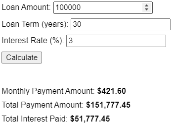

## Requirements

- The user should be able to enter:
  - Loan amount ($)
  - Loan term (in years)
  - Annual percentage rate - APR (%)
- Using the inputs, the calculator should compute the following and display the results to the user:
  - Monthly mortgage payment
  - Total payment amount
  - Total interest paid
- If a non-numerical string is entered into any input field, the calculator should display an error message. Additionally, the calculator should handle any other invalid inputs that may arise.
- Round the result amounts to 2 decimal places.

The formula for calculating the monthly payment is: `M = P(i(1+i)^n)/((1+i)^n - 1)`

- M: Monthly mortgage payment
- P: Loan amount
- i: Monthly interest rate (APR / 12)
- n: Total number of payments (loan term in years x 12)
